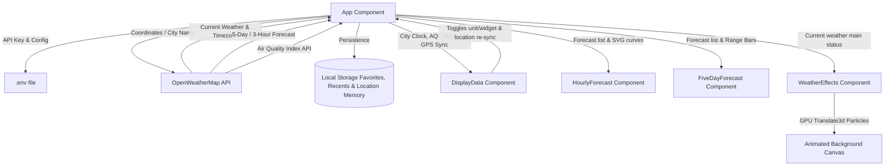

# Weather App React

### 🌐 [Live Site](https://weather.fcruz.org/)

A premium, production-grade weather dashboard built with React. This application offers a high-fidelity glassmorphic user interface complete with dynamic background particle animations matching current weather conditions, an interactive SVG hourly temperature trend line, Air Quality Index (AQI) monitoring, detailed metric cards (like a rotating wind compass), weekly temperature range bars, persistent location permission memory, local storage bookmarking, and a toggleable iOS/Android-style compact Widget Mode.

---

## 🛠️ Technology Stack

| Technology | Version | Icon / Badge | Description |
| :--- | :--- | :--- | :--- |
| **React** | `^17.0.2` |  | Core UI application library |
| **Axios** | `^0.21.1` |  | Promise-based HTTP client for API fetches |
| **Moment.js** | `^2.29.1` |  | Parse, validate, manipulate, and format times and dates |
| **Semantic UI React** | `^2.0.3` |  | Standard component structures and icon assets |
| **React Typed** | `^1.2.0` |  | Typewriter placeholder animations |
| **Vanilla CSS** | Modern (GPU) |  | Responsive grids, glassmorphism, and hardware-accelerated animations |

---

## 📊 System Architecture



---

## 📁 Directory Structure

```
Weather-App-React/
├── public/
├── src/
│   ├── components/
│   │   ├── displayData/
│   │   │   ├── DisplayData.js     # Main bento card, AQI card & location sync
│   │   │   └── display.css
│   │   ├── HourlyForecast/
│   │   │   ├── HourlyForecast.js  # Hourly list & Bezier SVG trend graph
│   │   │   └── HourlyForecast.css
│   │   ├── FiveDayForecast/
│   │   │   ├── FiveDayForecast.js # Weekly forecast & temperature range bars
│   │   │   └── FiveDayForecast.css
│   │   ├── WeatherEffects/
│   │   │   ├── WeatherEffects.js  # Dynamic animations (rain, snow, clouds, sun glow)
│   │   │   └── WeatherEffects.css
│   │   └── footer/
│   │       ├── Footer.js          # Footer links & location reset action
│   │       └── footer.css
│   ├── App.js                     # Core application state coordinator
│   ├── App.css                    # Theme classes, global variables & transitions
│   ├── index.js                   # Hydration anchor
│   ├── index.css                  # Google Fonts imports & resets
│   ├── service-worker.js          # PWA offline handlers
│   └── serviceWorkerRegistration.js
├── .env                           # Environment keys (ignored in Git)
├── .env.example                   # Example environment key template
├── .gitignore
├── package.json
└── README.md
```

---

## 🔄 Key Features & Application Workflow

### 1. Smart Location Permission Memory
* Uses native **Browser Permissions API** (`navigator.permissions.query`) alongside `localStorage` persistence.
* **Asks Only Once**: On a device's first visit, the app prompts for location access. Once granted or denied, it remembers the user's preference and never asks again unless manually cleared.
* **Cached Coordinates & On-Demand Sync**: Caches last known GPS coordinates (`last_lat`, `last_lon`) for instant loading on app open. Users can tap the GPS arrow icon next to the city name to re-detect location at any time, or click "Reset Location Permission" in the footer.

### 2. Air Quality Index (AQI) Monitoring
* Fetches real-time air pollution metrics from OpenWeatherMap (`/data/2.5/air_pollution`).
* Displays a dedicated **Air Quality Bento Card** with AQI levels (Good, Fair, Moderate, Poor, Very Poor), color-coded status badges, and PM2.5 pollutant concentration.

### 3. Recent Search History & Favorites
* Persists favorited cities and up to 5 recent city searches in `localStorage`.
* Displays interactive quick-chips for 1-click switching between favorite and recent locations.

### 4. Extreme Weather Warning Alerts
* Evaluates conditions in real-time and displays warning banners for severe weather (Thunderstorms, Squalls/Tornadoes, Extreme Heat > 38°C, and Freezing Temps < -5°C).

### 5. Live Weather Data & Dynamic Background Effects
* Sends parallel requests to OpenWeatherMap API for current weather and 5-day / 3-hour forecast data.
* Adapts background scenes using hardware-accelerated (GPU `translate3d`) particle effects for Rain, Snow, Thunderstorms, Cloud cover, and Clear Skies.

### 6. Bento Dashboard & In-App Widget Mode
* **Bento Grid**: Interactive modules for Wind status (with dynamic compass needle), Pressure, Humidity progress bar, Visibility, and Sunrise/Sunset times.
* **Widget Mode**: Toggles into a compact 440px glass card containing only essential weather metrics.

---

## ⚙️ Installation & Setup

1. **Clone the repository**:
   ```bash
   git clone https://github.com/ajf013/Weather-App-React.git
   cd Weather-App-React
   ```

2. **Install node dependencies**:
   ```bash
   npm install
   ```

3. **Configure your API Key**:
   Copy the example template `.env.example` to `.env` and add your OpenWeatherMap API key:
   ```bash
   cp .env.example .env
   ```
   Open the `.env` file and set your key:
   ```env
   REACT_APP_API_KEY=your_openweathermap_api_key
   ```

4. **Run the app locally**:
   ```bash
   npm start
   ```
   Open [http://localhost:3000](http://localhost:3000) to view it in the browser.

5. **Build for Production**:
   ```bash
   npm run build
   ```

---

## Author

### 👤 Francis Ponnu Cruz I
> **Azure Cloud & DevOps Engineer | Microsoft Certified Trainer (MCT)**

#### 🌐 Connect with Me:
[](https://github.com/ajf013)
[](https://www.linkedin.com/in/ajf013-francis-cruz/)
[](https://x.com/Itsme_Ajf013)
[](https://fcruz.org)
[](https://linktr.ee/AJF013)
