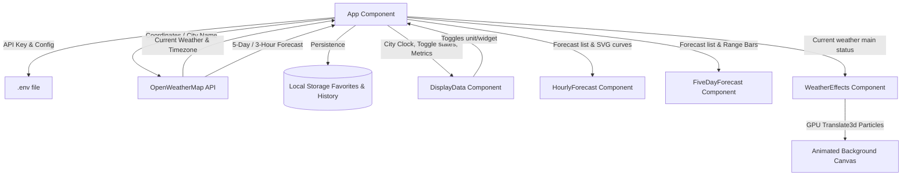

# Weather App React

### 🌐 [Live Site](https://weather.fcruz.org/)

A premium, production-grade weather dashboard built with React. This application offers a high-fidelity glassmorphic user interface complete with dynamic background particle animations matching current weather conditions, an interactive SVG hourly temperature trend line, detailed metric cards (like a rotating wind compass), weekly temperature range bars, local storage bookmarking, and a toggleable iOS/Android-style compact Widget Mode.

---

## 🛠️ Technology Stack

| Technology | Version | Icon / Badge | Description |
| :--- | :--- | :--- | :--- |
| **React** | `^17.0.2` |  | Core UI application library |
| **Axios** | `^0.21.1` |  | Promise-based HTTP client for API fetches |
| **Moment.js** | `^2.29.1` |  | Parse, validate, manipulate, and format times and dates |
| **Semantic UI React** | `^2.0.3` |  | Standard component structures and icon assets |
| **React Typed** | `^1.2.0` |  | Typewriter placeholder animations |
| **Vanilla CSS** | Modern (GPU) |  | Responsive grids, glassmorphism, and hardware-accelerated animations |

---

## 📊 System Architecture



---

## 📁 Directory Structure

```
Weather-App-React/
├── public/
│   ├── index.html
│   ├── manifest.json              # PWA manifest configurations
│   └── favicon.ico
├── src/
│   ├── components/
│   │   ├── displayData/
│   │   │   ├── DisplayData.js     # Main bento card & metrics
│   │   │   └── display.css
│   │   ├── HourlyForecast/
│   │   │   ├── HourlyForecast.js  # Hourly list & Bezier SVG trend graph
│   │   │   └── HourlyForecast.css
│   │   ├── FiveDayForecast/
│   │   │   ├── FiveDayForecast.js # Weekly forecast & temperature range bars
│   │   │   └── FiveDayForecast.css
│   │   ├── WeatherEffects/
│   │   │   ├── WeatherEffects.js  # Dynamic animations (rain, snow, clouds, sun glow)
│   │   │   └── WeatherEffects.css
│   │   └── footer/
│   │       ├── Footer.js
│   │       └── footer.css
│   ├── App.js                     # Core application state coordinator
│   ├── App.css                    # Theme classes, global variables & transitions
│   ├── index.js                   # Hydration anchor
│   ├── index.css                  # Google Fonts imports & resets
│   ├── service-worker.js          # PWA offline handlers
│   └── serviceWorkerRegistration.js
├── .env                           # Environment keys (ignored in Git)
├── .env.example                   # Example environment key template
├── .gitignore
├── package.json
└── README.md
```

---

## 🔄 Application Workflow

### 1. Startup & Geolocation Check
* Upon loading, `App.js` checks `localStorage` to load favorited cities.
* It checks the browser's geolocation status:
  - **Granted**: Automatically triggers GPS geolocation and fetches weather for your coordinates.
  - **Prompt**: Renders a glassmorphic **Location Request Prompt** explaining usage. Allows clicking "Allow Access" (triggers native prompt) or "Search Manually".
  - **Denied**: Avoids native alerts, loading your last searched city (or Coimbatore by default).

### 2. Live API Communication
* Sends parallel queries to the OpenWeatherMap API:
  - `data/2.5/weather` (Current conditions, wind degrees, visibility, humidity, timezone).
  - `data/2.5/forecast` (5-day forecast at 3-hour intervals).
* Supports dynamically appending `units=metric` (°C, m/s) or `units=imperial` (°F, mph).

### 3. Dynamic Visual Rendering & Animations
* Sets background wrapper classes based on the weather main status (`Rain`, `Clear`, `Clouds`, `Snow`, etc.) overlaying Unsplash backdrop photography.
* Launches `<WeatherEffects />` to draw hardware-accelerated (GPU-friendly `translate3d`) animation overlays:
  - **Rain**: Falling linear blue-white streaks.
  - **Snow**: Drifting circular flakes swaying horizontally.
  - **Clouds**: Semi-transparent drifting ovals.
  - **Clear**: Pulsing sun halo.
  - **Thunderstorm**: Lightning flashes matching rain.

### 4. Custom Calculations & Layout
* **Bento Grid**: Distributes pressure, humidity, visibility, and apparent feels-like index into individual dashboard modules. Employs a **wind compass pointer** rotated by the degree metrics.
* **Ticking Clock**: Runs a local ticking timer adjusted to the specific timezone offset of the searched city.
* **Hourly Trend SVG**: Computes Bezier curve vectors over the forecast data, aligning nodes and temperature text horizontally under scroll columns.
* **5-Day Range Bars**: Calculates the week's maximum temperature stretch and graphs daily spreads proportionally inside horizontal range bars.

### 5. In-App Widget Mode
* Toggling **Widget View** shifts the interface into a compact 440px glass card containing only the hero city, ticking local time, temperature, and current conditions.
* Hides navigation tabs, footers, search history, hourly lines, and 5-day charts.
* A floating exit controller floats at the top-right corner to allow a return to the full dashboard.

---

## ⚙️ Installation & Setup

1. **Clone the repository**:
   ```bash
   git clone https://github.com/ajf013/Weather-App-React.git
   cd Weather-App-React
   ```

2. **Install node dependencies**:
   ```bash
   npm install
   ```

3. **Configure your API Key**:
   Copy the example template `.env.example` to `.env` and add your OpenWeatherMap API key:
   ```bash
   cp .env.example .env
   ```
   Open the `.env` file and replace the placeholder value with your active API key.

4. **Run the app locally**:
   ```bash
   npm start
   ```
   Open [http://localhost:3000](http://localhost:3000) to view it in the browser.

5. **Build for Production**:
   ```bash
   npm run build
   ```

## Author

### 👤 Francis Ponnu Cruz I
> **Azure Cloud & DevOps Engineer | Microsoft Certified Trainer (MCT)**

#### 🌐 Connect with Me:
[](https://github.com/ajf013)
[](https://www.linkedin.com/in/ajf013-francis-cruz/)
[](https://x.com/Itsme_Ajf013)
[](https://fcruz.org)
[](https://linktr.ee/AJF013)

